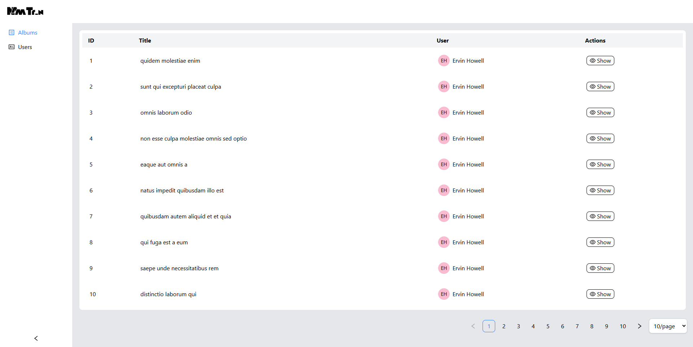
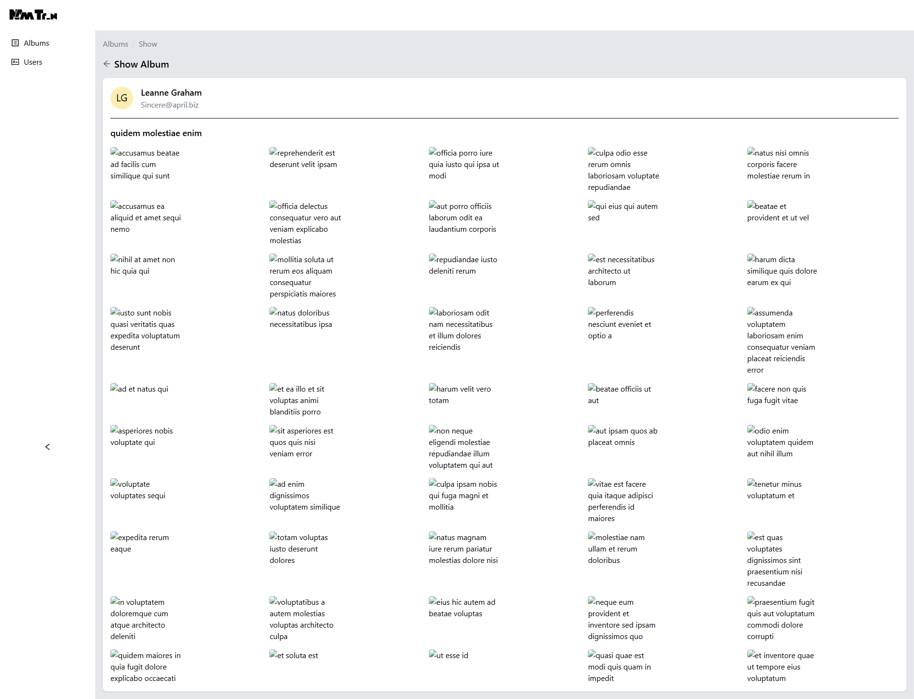
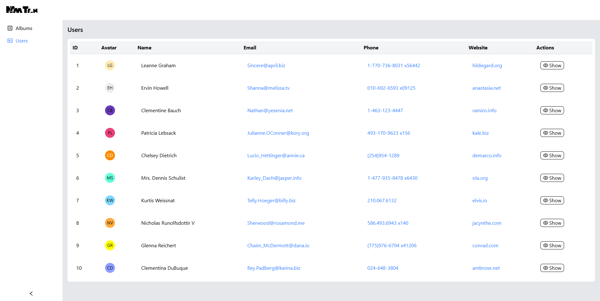
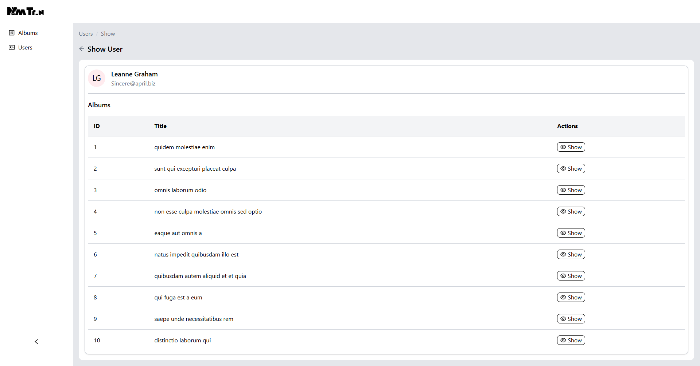

# 🧩 Album Viewer

## 📋 Mục tiêu / Mô tả ngắn

Album Viewer là một ứng dụng web React hiển thị danh sách người dùng, chi tiết người dùng, và các album ảnh từ API JSONPlaceholder. Ứng dụng cung cấp giao diện thân thiện để xem thông tin người dùng và duyệt ảnh trong các album.

## ⚙️ Công nghệ sử dụng

- **React**: Thư viện JavaScript để xây dựng giao diện người dùng.
- **Vite**: Công cụ build nhanh và hiện đại cho các dự án web.
- **React Router**: Thư viện định tuyến client-side cho React để quản lý các trang và điều hướng.
- **TailwindCSS**: Framework CSS để tạo kiểu nhanh chóng và responsive.
- **Axios**: Thư viện để thực hiện các yêu cầu HTTP tới API.

## 🧪 Cách chạy dự án (Development)

1. Clone repository:
   ```bash
   git clone https://github.com/tr-nam/product_prontend.git
   ```
2. Cài đặt dependencies:
   ```bash
   npm install
   ```
3. Chạy ứng dụng ở chế độ development:
   ```bash
   npm run dev
   ```
4. Mở trình duyệt và truy cập `http://localhost:5173`.

## 🚀 Cách build / deploy

1. Build ứng dụng cho production:
   ```bash
   npm run build
   ```
2. Kết quả build sẽ nằm trong thư mục `dist`.
3. Deploy lên các nền tảng như **Vercel**, **Netlify**, hoặc **GitHub Pages**:
   - Vercel: Import dự án từ GitHub và deploy trực tiếp.
   - Netlify: Kéo thả thư mục `dist` vào giao diện Netlify hoặc liên kết với repository.
   - GitHub Pages: Sử dụng action hoặc đẩy thư mục `dist` lên branch `gh-pages`.

## 📸 Demo hoặc ảnh chụp màn hình

- **Demo**: [Link demo nếu có]
- **Ảnh chụp màn hình**:
  - Danh sách Albums:Bảng hiển thị ID, Title, Users, Actions và nút "Show".
  
  - Chi tiết album: Breadcrumb, nút quay lại, thông tin người tạo, và lưới ảnh.
  
  - Danh sách người dùng: Bảng hiển thị ID, Avatar, Name, Email, Phone, Website, và nút "Show".
  
  - Chi tiết người dùng: Breadcrumb, nút quay lại, Avatar, Name, Email, và bảng danh sách album với ID, Title, và nút "Show".
  

## 🔧 Chức năng chính

✅ Hiển thị danh sách người dùng từ API JSONPlaceholder.  
✅ Xem chi tiết người dùng với avatar, tên, email, và danh sách album.  
✅ Hiển thị chi tiết album với lưới ảnh và hiệu ứng hover xem trước.  
✅ Breadcrumb điều hướng và nút quay lại.  
✅ Trạng thái loading đẹp khi chờ dữ liệu API.

## 🔮 Hướng phát triển / Todo

- Sử dụng thông tin từ Api
- Hiển thị thông tin ra giao diện người dùng
- Thêm phân trang cho danh sách người dùng và album.
- Tích hợp React Router để quản lý định tuyến client-side.

## 🧑‍💻 Thông tin tác giả / GitHub / liên hệ

- **Tên**: Nam Trần
- **GitHub**: [https://github.com/tr-nam]
- **Email**: [tr.namm29@gmail.com]
